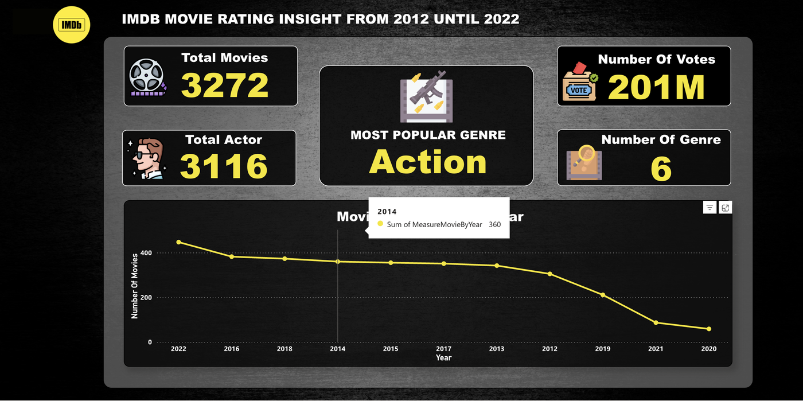

# IMDB Movie Rating Dashboard for Enhanced Film Industry Analysis

Leverages Power BI and R to reveal actionable patterns from IMDb movie ratings spanning 2012–2022, guiding production, casting, and marketing decisions with data-backed insights.

## 🔗 Interactive Dashboard

- **Live Power BI Experience:** [Open Dashboard](https://app.powerbi.com/view?r=eyJrIjoiN2M2MTFiMDItMGUyYi00Mjc3LThlZmEtOTQ1Yjk4NWM4NDUyIiwidCI6ImNkY2JiMGUyLTlmZWEtNGY1NC04NjcwLTY3MjcwNzc5N2FkYSIsImMiOjEwfQ%3D%3D)

## 📊 Data Scope

- **Source:** [IMDb Dataset of 50K Movie Reviews (Kaggle)](https://www.kaggle.com/datasets/lakshmi25npathi/imdb-dataset-of-50k-movie-reviews).
- **Period Covered:** 2012–2022 theatrical releases.
- **Key Attributes:** Title, release year, genre, IMDb rating, vote count, duration, region.

## 🌟 Dashboard Highlights

- **Director Spotlight:** Votes-by-director and gross-profit leaderboards showcase top-performing filmmakers (e.g., Ron Howard, Brad Bird) to guide collaboration strategies.
- **Movie Performance:** Highest-grossing titles (Jurassic World, Star Wars series) and annual popularity charts highlight blockbuster momentum and seasonal peaks.
- **Certificate Mix:** Pie chart segmentation reveals PG-13 dominance with notable PG and R clusters, aiding content rating strategies.
- **Talent Heatmap:** Tree map of leading actors (e.g., Dwayne Johnson, Tom Cruise) surfaces vote pull and genre alignment for casting decisions.
- **Genre Momentum:** Multi-year line chart displays Action and Adventure staying power while Horror and Romance show cyclical surges.

## 🛠️ Methodology

1. **Data Preparation (R):** Cleaned and wrangled raw IMDb exports; engineered seasonality metrics, director/actor aggregates, and certificate groupings.
2. **Modeling (Power BI):** Built star schema with fact tables (ratings, votes, gross) plus supporting dimensions (genre, release window, talent, certification).
3. **Visualization:** Crafted themed layouts with dynamic bookmarks, gauge cards (votes, gross), and drill-throughs for talent and title exploration.

## ✅ Usage

1. Access the dashboard via the link above (Power BI web view).
2. Use the slicers (Year, Genre, Region) to tailor insights to current production slates.
3. Hover over charts for tooltips detailing rating variance, vote confidence, and release seasonality.

## 🔍 Key Insights Uncovered

- **Dominant Genres:** Action and Adventure remain the most bankable genres from 2015 onward, with Horror trending upward in late-decade releases.
- **Seasonality:** Year-end periods (Nov–Dec) show elevated total votes, aligning with blockbuster release windows and award-season buzz.
- **Talent Signals:** Dwayne Johnson, Tom Cruise, and Ryan Reynolds top both leading-role counts and total votes, reinforcing the draw of franchise stars.
- **Director Impact:** Brad Bird and Francis Lawrence command the highest gross profits, suggesting strong ROI for sequels and animated features.
- **Certification Mix:** PG-13 accounts for ~37% of releases, providing a wide-audience sweet spot; unrated titles make up 22%, indicating opportunities to formalize ratings for broader reach.

## 📄 Resume Snapshot

- Developed an end-to-end Power BI dashboard enriched with R-driven data prep to inform casting, release timing, and marketing strategies for film studios.
- Delivered self-service analytics that surfaces 10-year genre performance, audience sentiment shifts, and high-potential talent combinations.

---

_Repository contains documentation only; raw dataset excluded for licensing considerations._
